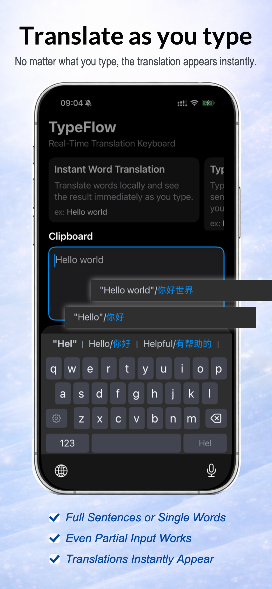
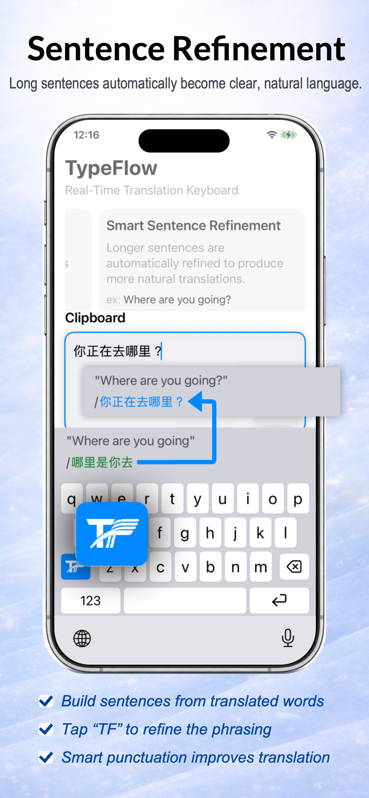
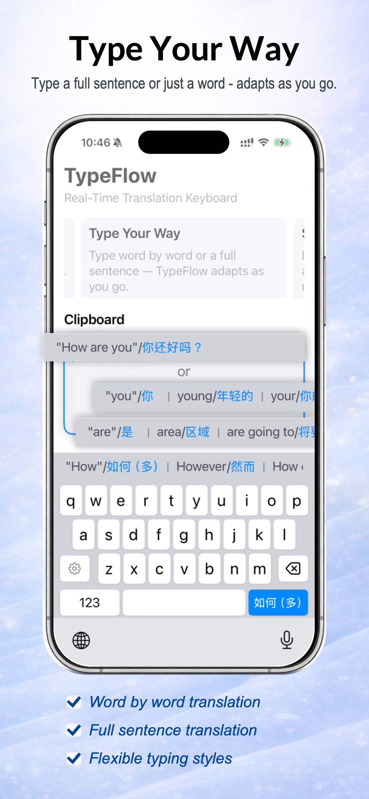
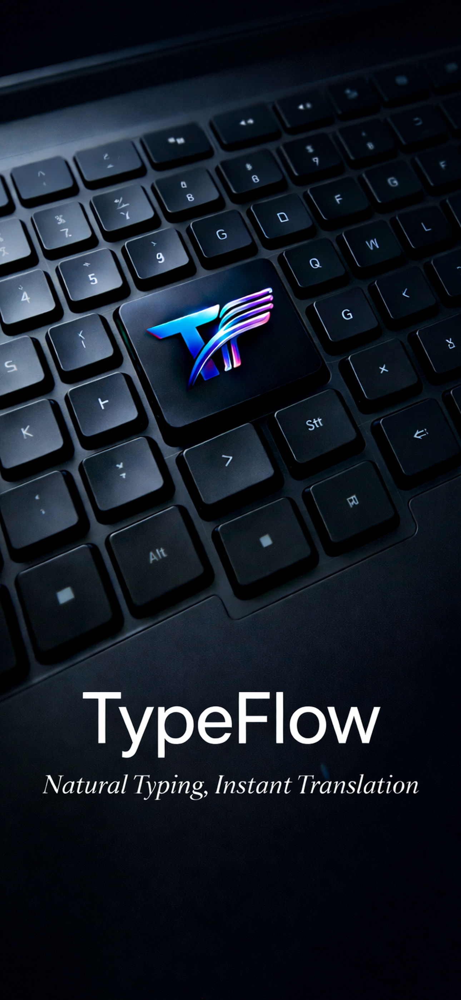

# TypeFlow

Natural Typing. Instant Translation.

TypeFlow is a real-time translation keyboard that converts English into your target language while you type.

No switching apps.  
No copy & paste.  
Just type — and see translation instantly.

---

## ✨ Features

### Translate as you type

TypeFlow continuously translates while you type.

It works whether you type:

- a single word  
- a partial phrase  
- a full sentence  

The translation appears instantly.

---

### Sentence refinement

Longer sentences automatically become clearer and more natural.

TypeFlow refines translation as your sentence grows.

Features include:

- build sentences from translated words  
- refine phrasing with a single tap  
- punctuation-aware translation  

---

### Type your way

TypeFlow adapts to how you write.

You can type word-by-word or full sentences.

Supported styles:

- word-by-word translation  
- full sentence translation  
- flexible input flow  

---

## 🔒 Fully Private

TypeFlow runs entirely **on-device**.

Your typing never leaves your phone.

- no cloud processing  
- no tracking  
- works offline  

Local translation may be less "AI-smart" than cloud services, but it is:

- faster  
- private  
- always available  

---

## 🌍 Built for real conversations

TypeFlow isn't designed for academic-perfect translation.

It is designed to help people **communicate across languages** while preserving meaning and emotion.

Fast translation keeps your thoughts flowing naturally.

---

## 📱 Works in any app

TypeFlow works anywhere you can type:

- WhatsApp  
- Messages  
- Instagram  
- Email  
- Notes  
- and more  

---

## 💡 Why TypeFlow exists

TypeFlow was created while traveling between countries and needing to communicate quickly.

Switching between translation apps and chat apps is slow.

TypeFlow solves this by translating directly inside the keyboard.

Type once.  
Translate instantly.

---

## 💰 One-time purchase

TypeFlow Chinese is unlocked with a **single purchase**.

No subscriptions.  
No recurring fees.

Use it forever.

---

## 🧑‍💻 Independent project

TypeFlow is built by an independent developer.

If you enjoy the idea of translating directly inside your keyboard, your support helps improve the project.

---

## 📬 Feedback

Suggestions and ideas are welcome.

See:

[FEEDBACK.md](FEEDBACK.md)

---

## 📄 License

See the [LICENSE](LICENSE) file for details.

---

## Preview

---

## App Icon

